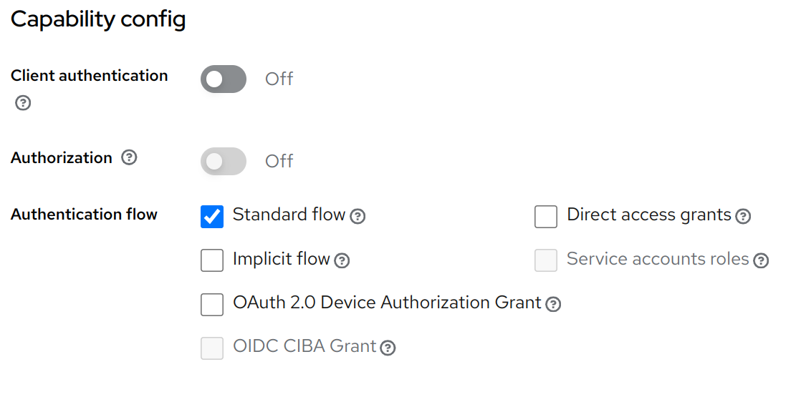

# Go OAuth2 PKCE CLI Application Example

This CLI application demonstrates an OAuth2 Authentication flow with Proof Key for Code Exchange (PKCE), integrated with Keycloak. It includes a local HTTP server to handle the authentication callback and an interactive command prompt that processes some processes some test inputs.

## Educational purpose disclaimer

This project is intended for educational purposes only and contains a number of simplifications and assumptions that are suitable for learning and experimentation rather than production use. It is designed to provide a basic understanding of OAuth2 with PKCE and how these mechanisms can be implemented using Go and Keycloak for CLI apllications. 

## Features

- **OAuth2 Authentication with PKCE**: Uses Keycloak to authenticate users securely.
- **Local HTTP Server**: Spawns a server to handle the redirect URI callback from the OAuth2 provider.
- **Interactive command prompt**: Continuously prompts for user input and echoes it back until "exit" is typed.

## Getting Started

These instructions will get you a copy of the project up and running on your local machine for development, testing and education purposes.

### Prerequisites

What you need to install the software:

- **Go 1.22.2**: Ensure Go is installed on your system. You can download it from [Go's official site](https://golang.org/dl/).
- **Docker and Docker Compose**: Required for running Keycloak using Docker. Installation guides can be found at [Docker](https://docs.docker.com/get-docker/) and [Docker Compose](https://docs.docker.com/compose/install/).

### Local Keycloak Server Setup

1. **Docker Compose for Keycloak**:
   - The project includes a `keycloak.docker-compose.yml` file to run Keycloak in a Docker container.
   - Your can optionally edit the `keycloak.docker-compose.yml` to specify a preffered local volume for persistent data storage
2. **Run Keycloak**:
   - Navigate to the directory containing `keycloak.docker-compose.yml` and start Keycloak using:
     ```bash
     docker compose -f keycloak.docker-compose.yml up
     ```
   - Access the Keycloak admin console at `http://localhost:8088/admin/master/console/` and log in with the default credentials from Docker Compose file.
3. **Configure Keycloak**:

    You can use your own realm and client settings. In this case you will have to make changes to the `main.go` file.

    - Once Keycloak is running, access the admin console
    - Create `test1_realm` realm
    - Add test user, don't forget to set creadentials
    - Create `test_cli_app` client with following settings:   
        - Root URL: `http://localhost:8080`
        - Valid redirect URIs: `http://localhost:8080/callback`
        - Web origins: `+`
        - Enable `Standard flow` checkbox

   <details>
      <summary>Click to show Keycloak client settings screenshots</summary>
      
       

      

      

   </details>
        

    
### Installing

A step-by-step series of examples that tell you how to get a development environment running:

1. **Clone the repository**:
   ```sh
   git clone https://github.com/dmazilov/cli-app-with-keycloak-example.git
   ```
2. **Enter project directory**:
    ```sh   
   cd cli-app-with-keycloak-example
   ```
2. **Run Go application**:
    ```sh   
   go run main.go 
   ```


## License
This project is licensed under the MIT License - see the LICENSE.md file for details.